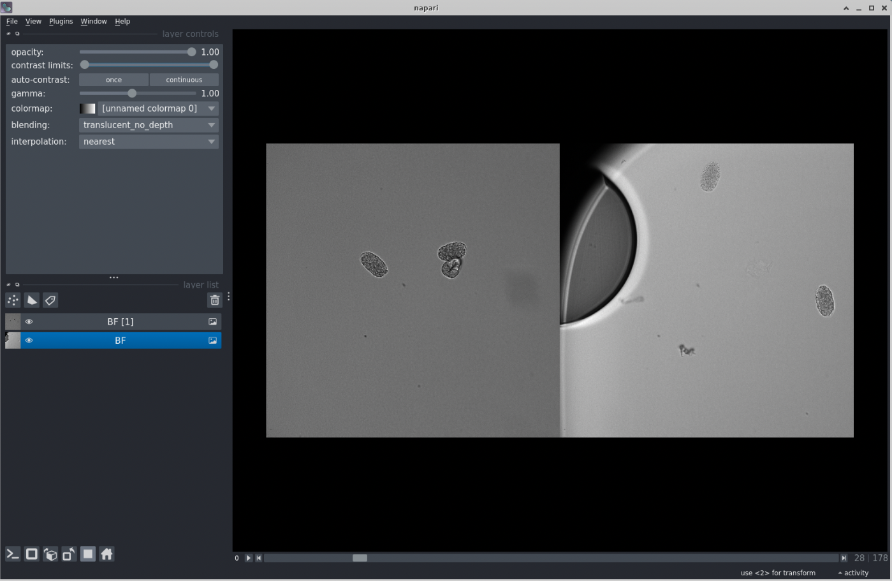
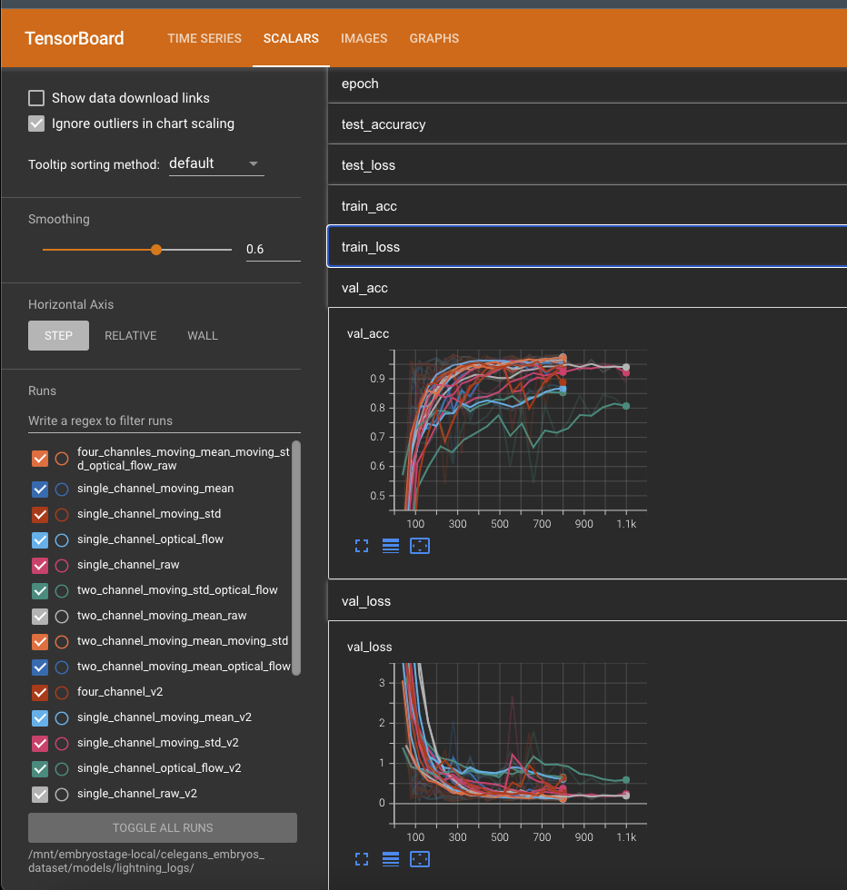
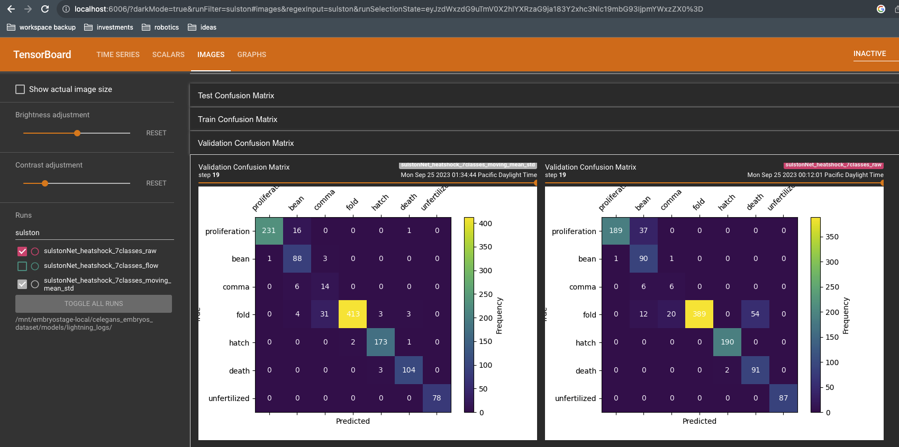
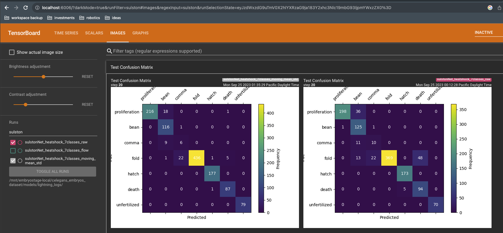

# 2023-nematode-embryo-classifier
This repo contains the code that accompanies the pub [](TODO: add link).


## Overview of the repo structure
TODO: write this


## Installation
This repository uses conda to manage software environments and installations.
You can find operating system-specific instructions for installing miniconda [here](https://docs.conda.io/en/latest/miniconda.html).
After installing conda and [mamba](https://mamba.readthedocs.io/en/latest/), setup a new conda environment.

Create a new conda environment:
```sh
    mamba create -n embryostage python=3.10
    conda activate embryostage
```

Then install the current version of the `embroystage` package:
```sh
    pip install git+https://github.com/Arcadia-Science/2023-embryostage.git
```


## Analysis pipeline
Here we describe each step in the data processing and analysis pipeline, beginning from a raw ND2 file. This includes the steps to crop, view, and annotate the images used in this project, as well as how to train a classifier to predict embryo developmental stage from these images.

### A note about data organization
Each imaging dataset consists of a single ND2 file that contains timelapse images of many different FOVs, each of which may contain multiple developing embryos. Each dataset is manually assigned an ID when it is converted from ND2 to zarr during step (1) below. This ID is called a `dataset_id`. It is a timestamp of the form `YYMMDD` that corresponds to the date the dataset was acquired.

The processed data generated by the processing scripts below is written to an arbitrary local directory specified by the user using the `--data-dirpath` CLI option.

The output of each script below is written to a separate subdirectory of this local `data_dirpath` directory.

### Step 1: Convert ND2 files to ome-zarr
We use the `nd2` and `iohub` packages to convert the Nikon ND2 format to ome-zarr format.

The conversion is performed by the `convert-nd2-to-zarr` command which points to [this script](../src/embryostage/scripts/convert_nd2_to_zarr.py). The user must specify the path to both the nd2 file and to the output directory. __The name of the output directory must be the `dataset_id`.__

For example, to convert a dataset whose ID is `'230719'`:
```sh
convert-nd2-to-zarr \
    --nd2-path /path/to/raw-data/230719/ChannelBF 20x_Seq0012.nd2 \
    --ome-zarr-path /path/to/processed-data/raw_data/230719
```
In this example, the `data_dirpath` is `'/path/to/processed-data'` and the `dataset_id` is `'230719'`.

Note that the `raw_data/230719/` subdirectory path must be specified explicitly.

Within the `data_dirpath` directory, this script generates the following directory structure:
```
raw_data
   └── {dataset_id}
	   └── {fov_id}
```
The `fov_id` subdirectories are zarr stores corresponding to each raw FOV. The `fov_ids` are of the form `'fov{n}'` where n is a linear index corresponding to the order of the FOVs in the nd2 file (as parsed by the `nd2` package).

To view one or more raw FOVs in napari, use the following command:
```sh
napari --plugin napari-ome-zarr 230719/fov0/ 230719/fov10 &
```



### Step 2: Segment embryos
The `find-embryos` command identifies embryos, crops ROIs around them, and writes the ROIs to zarr stores. The script requires a `--data-dirpath` option and `--dataset-id` option. It writes the cropped embryo zarr stores to the `cropped_embryos` subdirectory of the `data_dirpath` directory. This command points to [this script](../src/embryostage/scripts/find_embryos.py)

For example:
```sh
find-embryos --data-dirpath /path/to/processed-data/ --dataset-id 230719
```

Within the `data_dirpath` directory, this script generates the following directory structure:
```
├── cropped_embryos
│  └── {dataset_id}
│  		└── {fov_id}
│          │── {embryo_id}.zarr
│          └── detected_embryos.png
...
```
There are often multiple embryos cropped from each FOV (and, of course, there are multiple FOVs in each dataset). The `detected_embryos.png` figure shows the original FOV with bounding boxes around segmented embryos. The image data for the cropped embryos are written as zarr stores in `'{embryo_id}.zarr'`. The embryo ID is constructed from the x-y pixel coordinates of the center of the bounding box around each embryo. It is of the form `'embryo-{x_center}-{y_center}.zarr'`.


### Step 3: Annotate developmental stages
Use the `view-embryos` command to create a montage of embryos from a subset of FOVs. The subset of FOVs is manually specified using the `--fov-ids` option in the form of a comma-separated list of numeric FOV indices/ids. This command points to [this script](../src/embryostage/scripts/view_embryos.py)

For example, to view all embryos from the first three FOVs of the `'230719'` dataset:
```sh
view-embryos --data-dirpath /path/to/processed-data/ --dataset-id 230719 --fov-ids 0,1,2
```

The manual annotations should be added to [this csv file](../ground_truth/embryo_developmental_stage.csv). These human annotations of these embryos are treated as ground truth. The training pipeline splits the embryos in the training, validation, and test sets.

Explore the annotations as interpreted by the current code path using [`explore_annotated_embryos`](../src/embryostage/scripts/explore_annotated_embryos.py) script.


### Step 4: Compute features
Use the `encode-dynamics` command to encode the temporal dynamics (moving average and moving standard deviation) as channels. This script writes its output to the `encoded_dynamics` subdirectory of the `data_dirpath` directory. It has the same CLI options as the previous scripts. It points to [this script](../src/embryostage/scripts/encode_dynamics.py) For example:
```sh
encode-dynamics --data-dirpath /path/to/processed-data/ --dataset-id 230719
```

Within the `data_dirpath` directory, this script generates the following directory structure:
```
encoded_dynamics
└── {dataset_id}
   └── {fov_id}
      └── {embryo_id}.zarr
          └── dynamic_features
```

### Step 5: Train a classifier
Use the `train-models` command to train a classifier using the [ground truth annotations](../ground_truth/embryo_developmental_stage.csv) of developmental stages generated by a human annotator in step (3) above and the features encoded in step (4) above. This command points to [this script](../src/embryostage/scripts/train_models.py).

We use the PyTorch Lightning framework to structure the code for data loading, training, logging, and inference. Note that this framework automatically selects the best device (e.g. the CPU or a GPU) to train on by inspecting the environment in which it is run.

Like the prior command, this command requires the `--data-dirpath` option; it loads the features generated in step (4) from the `encoded_dynamics` subdirectory of `data_dirpath` for the subset of embryos (from any number of FOVs and datasets) that were manually annotated. The script also requires the `--logs-dirpath` option to specify the directory to which the training logs and model checkpoints are written. Its structure looks like this:
```
{logs_dirpath}
└── lightning_logs
    └── SulstonNet_raw
        ├── checkpoints
        └── hparams.yaml
```

### Step 6: Evaluate a classifier
Use tensorboard to view the training logs:
```sh
tensorboard --logdir /path/to/lightning_logs/ &
```
Check the following in the log to assess the model performance.

#### Validation loss and accuracy


#### Validation confusion matrix over a few epochs


#### Test confusion matrix computed at the end of the training


You can also view the predictions overlaid on samples of training and validation datasets.


### Step 7: Use a classifier
Use the `view-embryo-classification` command to view the classification of an embryo overlaid on the image using napari. This command requires a number of CLI options to specify a particular model checkpoint to use for inference and a particular embryo. It points to [this script](../src/embryostage/scripts/view_embryo_classification.py)

For example:
```sh
view-embryo-classification \
    --checkpoint-filepath /path/to/models/lightning_logs/model_name/checkpoints/checkpoint-epoch=17-val_loss=0.12.ckpt \
    --data-dirpath /path/to/processed-data/encoded_dynamics \
    --dataset-id 230719 \
    --fov-id 0 \
    --embryo-id 0181-0141 \
    --channels-type raw-only
```

### Step 8: Use a classifier to predict embryo stages
Use the `batch-classify-embryos` command to predict the developmental stage at each timepoint for all cropped embryos in a given dataset. This command uses the same CLI options as the `view-embryo-classification` command but does not require an FOV ID or embryo ID. It outputs the predictions in a JSON file in the same directory as the checkpoint file.


### Step 9: Post-processing to clean up predictions
The predictions for each embryo generated by `batch-classify-embryos` above can be noisy. To clean them up, use the post-processing script:
```sh
post-process-predictions \
    --predictions-filepath /path/to/predictions.json
    --output-dirpath /path/to/output/dir
```
This script generates plots of the predictions and a new version of the JSON file of predictions; both are written to the `output_dirpath` directory.

## Analysis and figure generation
There are several additional scripts that we used to generate the figures shown in [the pub](TODO: add link here).

### Confusion matrices
To generate a publication-quality plot of the confusion matrices, use the `plot-confusion-matrix` command. It points to [this script](../src/embryostage/scripts/plot_confusion_matrix.py).
This command takes both a path to a set of manual annotations (which can, and should, be different from the annotations used to train the model)
and a path to a JSON file of predictions generated by the `batch-classify-embryos` command discussed above. The manual annotations should adhere to the schema of the training annotations included with this repo [here](../ground_truth/embryo_developmental_stage.csv).

The script writes the confusion matrix as a PDF in the same directory that contains the JSON file of predictions.

### Tiled images of embryo timelapses
The "filmstrips" of tiled embryo timelapses are generated by the `tile-embryos` command, which points to [this script](../src/embryostage/scripts/tile_embryos.py). By default, it generates a tiled image containing *all* embryos in a given dataset. Like the pre-processing commands, it requires the `--data-dirpath` and `--datased-id` arguments to specify the location of the directory containing the cropped embryos and a particular dataset_id, respectively.

It also optionally takes arguments that specify the factor by which to subsample embryos, timepoints, and x-y pixels. These arguments control the size of the resulting tiled image (which can be very large if there are hundreds of embryos in the dataset). Refer to the docs in the `tile_embryos.py` script for details.


# Feedback, contributions, and reuse
We try to be as open as possible with our work and make all of our code both available and usable. 
We love receiving feedback at any level, through comments on our pubs or Twitter and issues or pull requests here on GitHub.
In turn, we routinely provide public feedback on other people’s work by [commenting on preprints](https://sciety.org/lists/f8459240-f79c-4bb2-bb55-b43eae25e4f6), filing issues on repositories when we encounter bugs, and contributing to open-source projects through pull requests and code review.

Anyone is welcome to contribute to our code.
When we publish new versions of pubs, we include a link to the "Contributions" page for the relevant GitHub repo in the Acknowledgements/Contributors section.
If someone’s contribution has a substantial impact on our scientific direction, the biological result of a project, or the functionality of our code, the pub’s point person may add that person as a formal contributor to the pub with "Critical Feedback" specified as their role.

Our policy is that external contributors cannot be byline-level authors on pubs, simply because we need to ensure that our byline authors are accountable for the quality and integrity of our work, and we must be able to enforce quick turnaround times for internal pub review.
We apply this same policy to feedback on the text and other non-code content in pubs.

If you make a substantial contribution, you are welcome to publish it or use it in your own work (in accordance with the license — our pubs are CC BY 4.0 and our code is openly licensed).
We encourage anyone to build upon our efforts.


