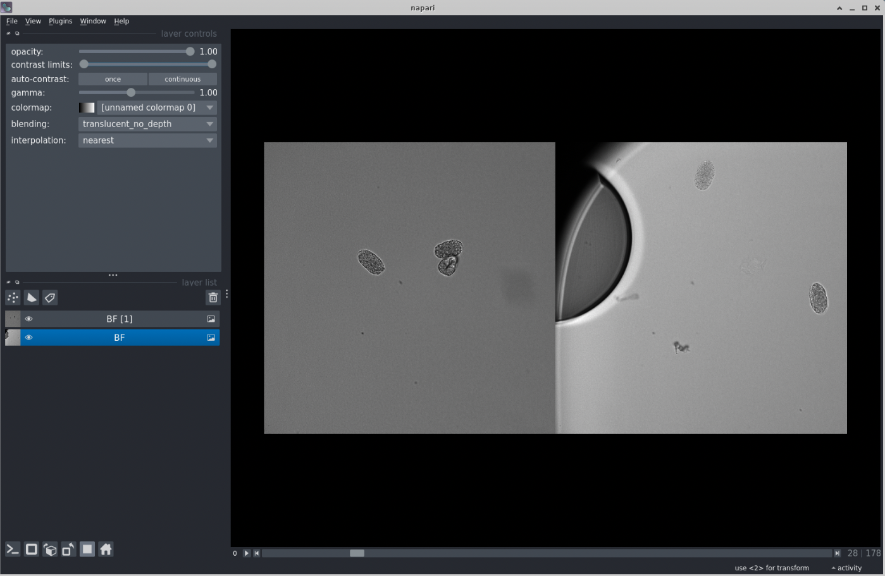
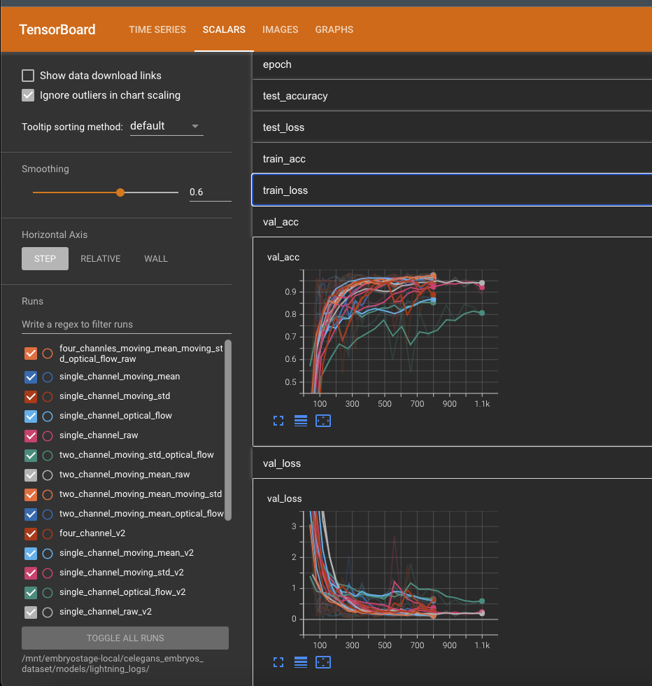
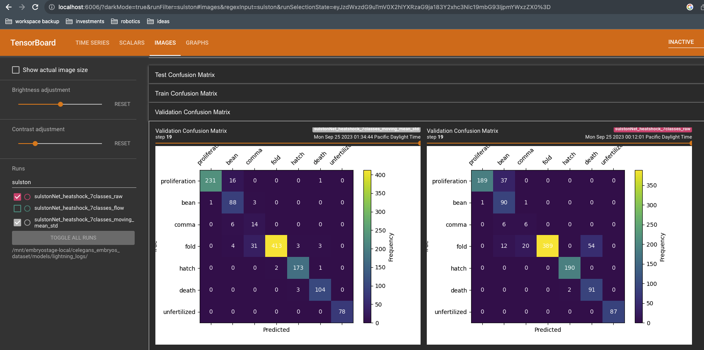
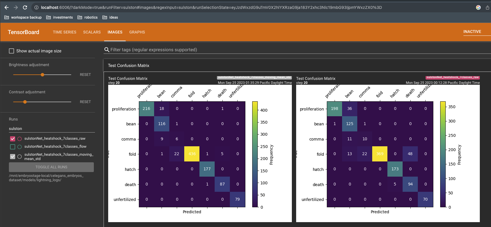

# EmryoStage pipeline
This document describes how to process, view, and annotate the raw label-free images of developing embryos used in this project. It also describes how to train a classifier to predict embryo developmental stage from such images. 

## Data organization
Each Imaging dataset consists of a single nd2 file that contains timelapse images of many different FOVs, each of which may contain multiple developing embryos. Each dataset is manually assigned an ID when it is converted from nd2 to zarr during step (1) below. This ID is called a `dataset_id`. It is a timestamp of the form `YYMMDD` that corresponds to the date the dataset was acquired. 

The processed data generated by the processing scripts below is written to an arbitrary local directory specified by the user using the `--data-dirpath` CLI option. 

The output of each script below is written to a separate subdirectory of this local `data_dirpath` directory. 

## Step 1: Convert nd2 files to ome-zarr
We use the `nd2` and `iohub` packages to convert the Nikon ND2 format to ome-zarr format. 

The conversion is performed by the [`convert_nd2_to_ome_zarr.py`](../src/embryostage/scripts/convert_nd2_to_ome_zarr.py) script. The user must specify the path to both the nd2 file and to the output directory. __The name of the output directory must be the `dataset_id`.__

For example, to convert a dataset whose ID is `'230719'`:
```sh
python src/embryostage/scripts/convert_nd2_to_zarr.py  \
    --nd2-path /path/to/raw-data/230719/ChannelBF 20x_Seq0012.nd2 \
    --ome-zarr-path /path/to/processed-data/raw_data/230719
```
In this example, the `data_dirpath` is `'/path/to/processed-data'` and the `dataset_id` is `'230719'`.

Note that the `raw_data/230719/` subdirectory path must be specified explicitly. 

Within the `data_dirpath` directory, this script generates the following directory structure:
```
raw_data
   └── {dataset_id}
	   └── {fov_id}
```
The `fov_id` subdirectories are zarr stores corresponding to each raw FOV. The `fov_ids` are of the form `'fov{n}'` where n is a linear index corresponding to the order of the FOVs in the nd2 file (as parsed by the `nd2` package). 

To view one or more raw FOVs in napari, use the following command:
```sh
napari --plugin napari-ome-zarr 230719/fov0/ 230719/fov10 &
```



## Step 2: Segment embryos
The [`find_embryos.py`](../src/embryostage/scripts/find_embryos.py) script identifies embryos, crops ROIs around them, and writes the ROIs to zarr stores. The script requires a `--data-dirpath` option and `--dataset-id` option. It writes the cropped embryo zarr stores to the `cropped_embryos` subdirectory of the `data_dirpath` directory. 

For example:
```sh
python src/embryostage/scripts/find_embryos.py \
    --data-dirpath /path/to/processed-data/ --dataset-id 230719
```

Within the `data_dirpath` directory, this script generates the following directory structure:
```
├── cropped_embryos
│  └── {dataset_id}
│  		└── {fov_id}
│          │── {embryo_id}.zarr
│          └── detected_embryos.png
...
```
There are often multiple embryos cropped from each FOV (and, of course, there are multiple FOVs in each dataset). The `detected_embryos.png` figure shows the original FOV with bounding boxes around segmented embryos. The image data for the cropped embryos are written as zarr stores in `'{embryo_id}.zarr'`. The embryo ID is constructed from the x-y pixel coordinates of the center of the bounding box around each embryo. It is of the form `'embryo-{x_center}-{y_center}.zarr'`. 


## Step 3: Annotate developmental stages
Use the [`view_embryos.py`](../src/embryostage/scripts/view_embryos.py) script to create a montage of embryos from a subset of FOVs. The subset of FOVs is manually specified using the `--fov-ids` option in the form of a comma-separated list of numeric FOV indices/ids. 

For example, to view all embryos from the first three FOVs of the `'230719'` dataset:
```sh
python src/embryostage/scripts/view_embryos.py \
    --data-dirpath /path/to/processed-data/ --dataset-id 230719 --fov-ids 0,1,2
```

The manual annotations should be added to [this csv file](../ground_truth/embryo_developmental_stage.csv). These human annotations of these embryos are treated as ground truth. The training pipeline splits the embryos in the training, validation, and test sets.

Explore the annotations as interpreted by the current code path using [`explore_annotated_embryos`](../src/embryostage/scripts/explore_annotated_embryos.py) script.


## Step 4: Compute features
Use the [`encode_dynamics.py`](../src/embryostage/scripts/encode_dynamics.py) script to encode the temporal dynamics (moving average, moving standard deviation, and optical flow) as channels. This script writes its output to the `encoded_dynamics` subdirectory of the `data_dirpath` directory. It has the same CLI options as the previous scripts. For example:
```sh
python src/embryostage/scripts/encode_dynamics.py \
    --data-dirpath /path/to/processed-data/ --dataset-id 230719
```

Within the `data_dirpath` directory, this script generates the following directory structure:
```
encoded_dynamics
└── {dataset_id}
   └── {fov_id}
      └── {embryo_id}.zarr
          └── dynamic_features
```

## Step 5: Train a classifier
Use the [`train_models.py`](../src/embryostage/scripts/train_models.py) script to train a classifier using the [ground truth annotations](../ground_truth/embryo_developmental_stage.csv) of developmental stages generated by a human annotator in step (3) above and the features encoded in step (4) above. We use the PyTorch Lightning framework to structure the code for data loading, training, logging, and inference.

Like the prior scripts, this script requires the `--data-dirpath` option; it loads the features generated in step (4) from the `encoded_dynamics` subdirectory of `data_dirpath` for the subset of embryos (from any number of FOVs and datasets) that were manually annotated. The script also requires the `--logs-dirname` option to specify the name of directory to which training logs and model checkpoints are written. This directory is in `{data_dirpath}/models/{logs_dirname}/`. Its structure looks like this:
```
models
└── {logs_dirname}
    └── lightning_logs
    └── SulstonNet_raw
        ├── checkpoints
        ├── events.out.tfevents.1698686529.{system_name}.55347.0
        └── hparams.yaml
```

## Step 6: Evaluate a classifier
Use tensorboard to view the training logs:
```sh
tensorboard --logdir /path/to/lightning_logs/ &
```
After tensorboard launches, forward the port 6006 to your local computer to be able to view the logs. Check the following in the log to assess the model performance. 

### Validation loss and accuracy


### Validation confusion matrix over a few epochs


### Test confusion matrix computed at the end of the training


You can also view the predictions overlaid on samples of training and validation datasets. 


## Step 7: Use a classifier
Use the [`view_embryo_classification.py`](../src/embryostage/scripts/view_embryo_classification.py) script to view the classification of an embryo overlaid on the image using napari. This script requires a number of CLI options to specify a particular model checkpoint to use for inference and a particular embryo. 

For example:
```sh
python src/embryostage/scripts/view_embryo_classification.py \
    --checkpoint-filepath /path/to/models/lightning_logs/model_name/checkpoints/checkpoint-epoch=17-val_loss=0.12.ckpt \
    --data-dirpath /path/to/processed-data/encoded_dynamics \
    --dataset-id 230719 \
    --fov-id 0 \
    --embryo-id 0181-0141 \
    --channels-type raw-only
```

Use [`batch_classify_embryos.py`](../src/embryostage/scripts/batch_classify_embryos.py) to predict the developmental stage at each timepoint for all cropped embryos in a given dataset. This script uses the same CLI options as the `view_embryo_classification.py` script but does not require an FOV ID or embryo ID. 

