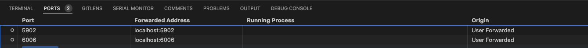

# EmryoStage pipeline
# convert nd2 files to ome-zarr store
* Use [nd2omezarr](../src/embryostage/scripts/nd2omezarr.py), and update `n2_path` and `ome_zarr_path` paths.
* After the conversion you should have a zarr store with this structure.
```
230817_N2_heatshock_raw.zarr/
├── fov0
│   └── raw
├── fov1
│   └── raw
...
```
* FOVs can be viewed with napari

```
napari --plugin napari-ome-zarr 230817_N2_heatshock_raw.zarr/fov0/ 230817_N2_heatshock_raw.zarr/fov10 &
```


## segment movies of embryos
* Use [find_embryos](../src/embryostage/scripts/find_embryos.py), update paths, and analysis parameters based on [experimental metadata](../ground_truth/embryo_metadata.csv).
* After the segmentation, you should have a folder with this structure.
```
230817_N2_heatshock/
├── 230817_0
│   └── detected_embryos.png 
├── 230817_1
│   └── detected_embryos.png
├── 230817_10
│   ├── detected_embryos.png
│   └── embryo0.zarr
│       ├── 0.0.0.0.0
...
```
`detected_embryos.png` shows the original FOV with bounding boxes around segmented embryos. The ROIs with embryos are exported as zarr stores `embryo<n>.zarr`

## annotate developmental events
* Use [view_emryos](../src/embryostage/scripts/view_embryos.py) to create a montage of embryos that you want to annotate.
* Version the annotations for all the embryos in [this csv file](../ground_truth/embryo_developmental_stage.csv). These human annotations of these embryos are treated as ground truth. The training pipeline splits the embryos in the training, validation, and test sets.
* Explore the annotations as interpreted by the current code path using [explore_annotated_embryos](../src/embryostage/scripts/explore_annotated_embryos.py) script.

## compute features
* Use [encode_dynamics](../src/embryostage/scripts/encode_dynamics.py) script to encode the temporal dynamics (moving average, moving standard deviation, and optical flow) as channels. These channels are saved along side movies of each embryo. After running this script, you should have a folder with this tructure.

```
230817_N2_heatshock/
├── 230817_0
│   └── detected_embryos.png
├── 230817_1
│   └── detected_embryos.png
├── 230817_10
│   ├── detected_embryos.png
│   └── embryo0.zarr
│       ├── 0.0.0.0.0
│       └── dynamic_features
```

Notice the addition of the `dynamic_features` zarr group to the store.

## train a classifier
* Use [train_models](../src/embryostage/scripts/train_models.py) to use the [ground truth annotations of key frames](../ground_truth/embryo_developmental_stage.csv) and train a classifier. We use PyTorch Lightning framework to structure the code for data loading, training, logging, and inference.

The model weights and logs are exported in `models` folder, which looks like this:
```
models
└── lightning_logs
    ├── four_channel_v2
    │   ├── checkpoints
    │   ├── events.out.tfevents.1693982742.SFO-IT0770.czbiohub.org.64941.0
    │   ├── events.out.tfevents.1694012162.SFO-IT0770.czbiohub.org.64941.1
    │   └── hparams.yaml
    ├── four_channles_moving_mean_moving_std_optical_flow_raw
    │   ├── checkpoints
    │   ├── events.out.tfevents.1693900520.SFO-IT0770.czbiohub.org.6782.0
    │   ├── events.out.tfevents.1693905250.SFO-IT0770.czbiohub.org.6782.1
```

## evaluate a classifier

* Use tensorboard to view the logs. 
```
tensorboard --logdir /mnt/embryostage-local/celegans_embryos_dataset/models/lightning_logs/ &
```

After tensorboard launches, forward the port 6006 to your local computer to be able to view the logs. This is easily done with vscode's built in port forwarding utility. 


* Check the following in the log to assess the model performance:
    * Validation loss and accuracy
    

    * Validation confusion matrix over a few epochs.
    

    * Test confusion matrix computed at the end of the training.
    


* You can also view the predictions overlaid on samples of training and validation datasets. 

##  use a classifier

* Use [view_embryo_classification](../src/embryostage/scripts/view_embryo_classification.py) script to view the classification of an embryo overlaid on the image using napari.

* Use [batch_classify_embryos](../src/embryostage/scripts/batch_classify_embryos.py) to classify the developmental stage of many embryos at each of the frames.